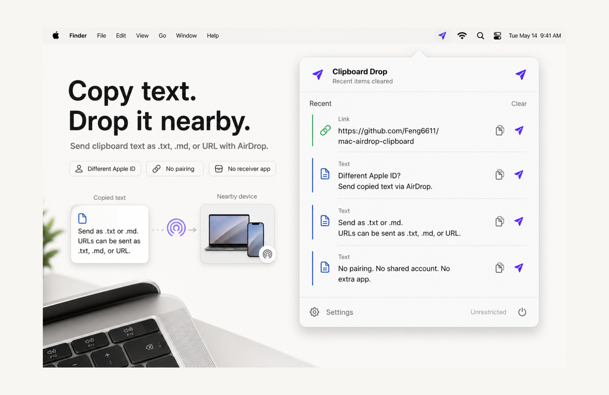

<p align="center">
  
</p>

<h1 align="center">Clipboard Drop</h1>

<p align="center">
  <strong>Copy. Send. Done.</strong><br>
  Turn clipboard text into an AirDrop file — no receiver app, no cloud sync, no same Apple ID required.
</p>

<p align="center">
  <a href="#install">Install</a> · <a href="#how-it-works">How It Works</a> · <a href="#faq">FAQ</a> · <a href="PRIVACY.md">Privacy</a>
</p>

<p align="center">
  
</p>

## Features

- **Menu bar app** — copy text, click send, pick a device
- **No setup on the receiver** — any device that accepts AirDrop can receive
- **Text & links** — sends as `.txt`, `.md`, or URL file, configurable in settings
- **Private** — clipboard stays local, history is in-memory only, cleared on quit
- **Open source** — MIT licensed, easy to audit

## Install

> Requires macOS 14 Sonoma or later.

**[Download on the Mac App Store](https://apps.apple.com/app/id6768068044?pt=128417926&ct=readme)** — lifetime purchase, no subscription.

Or build from source:

```sh
./script/build_and_run.sh
```

## How It Works

1. Copy any text or URL
2. Click the Clipboard Drop icon in the menu bar
3. Hit **Send** — the app writes a temporary file and hands it to AirDrop
4. Pick a nearby device in the AirDrop picker

The receiver does not need Clipboard Drop installed.

## Clipboard Drop Pro

Sending the current clipboard or resending a recent item is a Pro feature.
Every install can start one explicit two-day trial. After the trial, choose
one of these lifetime unlocks:

- **Lifetime** — $6.99
- **Lifetime + Support** — $10.99

Both unlock the same Pro features. The app uses Apple in-app purchases through
RevenueCat; prices shown by the store may be localized by territory.
On first launch, a short introduction explains the menu bar workflow before
showing these options. The trial begins only when you choose **Start 2-day free
trial**; it is not a subscription and does not renew or charge automatically.

| Content | Available formats |
|---|---|
| Text | `.txt` · `.md` |
| URL | `.txt` · `.url` |

## FAQ

<details>
<summary><strong>Does the receiver need to install anything?</strong></summary>
No. Any device that can receive AirDrop can open the text file or URL.
</details>

<details>
<summary><strong>Does it sync clipboard content?</strong></summary>
No. No cloud sync, no accounts, no servers.
</details>

<details>
<summary><strong>Does it store clipboard history?</strong></summary>
Recent items are kept in memory while the app runs. Nothing is written to disk. Quitting the app clears everything.
</details>

<details>
<summary><strong>Why not just use Universal Clipboard?</strong></summary>
Universal Clipboard needs the same Apple ID and Handoff enabled on both devices. Clipboard Drop works with any nearby AirDrop-capable device regardless of account.
</details>

## Development

```sh
# Build & run
./script/build_and_run.sh

# Verify build
./script/build_and_run.sh --verify

# Run tests
xcodebuild test -project ClipDrop.xcodeproj -scheme ClipDrop \
  -destination 'platform=macOS,arch=arm64'
```

See [Docs/Architecture.md](Docs/Architecture.md) for the codebase structure and
[Docs/RevenueCat.md](Docs/RevenueCat.md) for commerce setup and sandbox checks.

## Privacy

Clipboard Drop collects no data. Everything runs locally on your Mac. See [PRIVACY.md](PRIVACY.md).

## About

Built by [chenfeng](https://github.com/Feng6611) — I make small,
permission-light Mac utilities. More: [Command Reopen](https://commandreopen.com) · [Obsidian plugins](https://github.com/Feng6611)

## License

[MIT](LICENSE)
